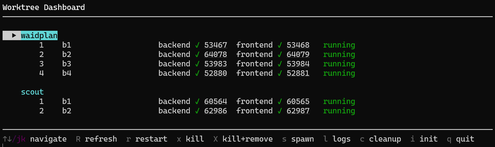

# Worktree Dashboard

Interactive TUI for managing parallel git worktree sessions with dev servers, across multiple projects.



## Features

- **Multi-project view** — monitor worktree sessions from multiple projects in one place
- **Keyboard-driven** — navigate, spawn, kill, restart, view logs, and clean up without leaving the terminal
- **Clickable port links** — server ports are OSC 8 hyperlinks; click to open in your browser
- **Live server health** — per-server UP/DOWN status via PID checks
- **Robust removal** — detects locked worktrees (e.g. still in use by another process) and reports actionable errors instead of silently failing
- **Claude terminal on spawn** — new sessions automatically open a Claude Code terminal in the worktree
- **Cross-platform** — Windows, macOS, Linux

## Prerequisites

- Python 3.9+
- [`rich`](https://pypi.org/project/rich/) pip package
- One or more git repositories you want to manage

## Setup

1. Clone the repository:
   ```bash
   git clone https://github.com/manuelschurr/worktree-dashboard.git
   cd worktree-dashboard
   ```

2. Install dependencies:
   ```bash
   pip install rich
   ```

3. Copy the example config and add your project paths:
   ```bash
   cp config.example.toml config.toml
   ```

4. Run the dashboard:
   ```bash
   python tui.py
   ```

5. For projects that haven't been set up yet, select the project and press `i` to initialize (creates `.orchestrator.toml` and `.orchestrator/` directory).

## Config

The dashboard uses a `config.toml` file to know which projects to monitor. Each `[[projects]]` entry points to a git repository root. Projects don't need to be initialized yet — you can do that from the dashboard with `i`.

```toml
# List the projects you want to monitor.
# Each project should have a .orchestrator.toml in its root.
# Copy this file to config.toml and edit the paths.

[[projects]]
path = "/path/to/your-project"

# [[projects]]
# path = "/path/to/another-project"
```

Add as many `[[projects]]` entries as you like — they all appear in the dashboard.

## Keybindings

| Key | Action | Context |
|-----|--------|---------|
| `↑` / `k` | Move selection up | Always |
| `↓` / `j` | Move selection down | Always |
| `R` | Refresh all data | Always |
| `r` / `Enter` | Restart session | Session selected |
| `x` | Kill session (stop servers) | Session selected |
| `X` | Kill + remove session and worktree | Session selected |
| `s` | Spawn new session | Project or session selected |
| `l` | View server logs | Session selected |
| `c` | Clean up ghost sessions | Always |
| `i` | Initialize orchestrator in project | Project or session selected |
| `q` | Quit | Always |

Session-specific actions (`r`, `x`, `X`, `l`) only work when a session row is selected. `s` and `i` work on both project headers and session rows.

## How It Works

The dashboard reads each project's `.orchestrator/sessions.json` to build the display. All actions shell out to `orchestrator.py`, which handles worktree creation, server lifecycle, and session tracking.

Sessions are shown with real-time health: server PIDs are checked to determine if each server is UP or DOWN. Sessions whose worktree directories no longer exist are marked as "ghost" and can be cleaned up.

## Pairing with the Claude Code Skill

This dashboard is fully standalone — it includes everything you need. If you also use [Claude Code](https://claude.ai/claude-code), there's a companion skill called [worktree-orchestrator](https://github.com/manuelschurr/worktree-orchestrator) that lets Claude manage worktree sessions conversationally. Both share the same `orchestrator.py` engine, so projects work with either or both.

## License

[MIT](LICENSE)
